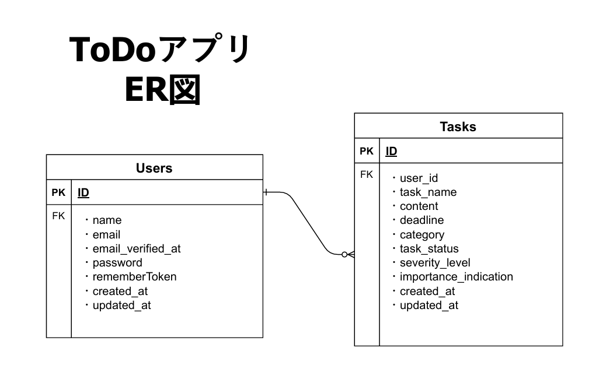

# ★To do アプリ

## ■アプリURL
https://my-todo-sigma-two.vercel.app/

### ■テストアカウント
~~~
メールアドレス：test@example.com
パスワード：12345678
~~~
 
## ■使用技術一覧
* Laravel
* PHP
* HTML
* CSS
* MYSQL
* Tailwind CSS

## ■アプリ機能一覧
* 会員新規登録＆ログイン
* タスクの追加
* タスクの編集
* ステータス/重要度/緊急度/デットライン
* タスクの削除
* ページネーション

## ■今後の実装予定
* フィルター機能
* コメント機能

## ■開発環境
* Windows 11
* Laravel Framework 10.48.25
* PHP 8.2.27
* Laravel Sail
* Docker Desktop

### ■その他
* PHPMyAdmin
* VSCode
* GitHub

## ■データベース設計

* ER図
